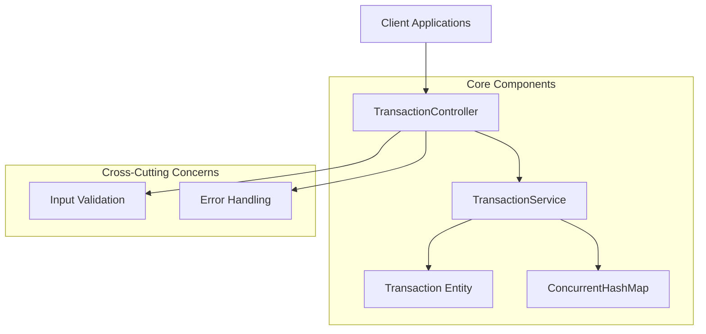
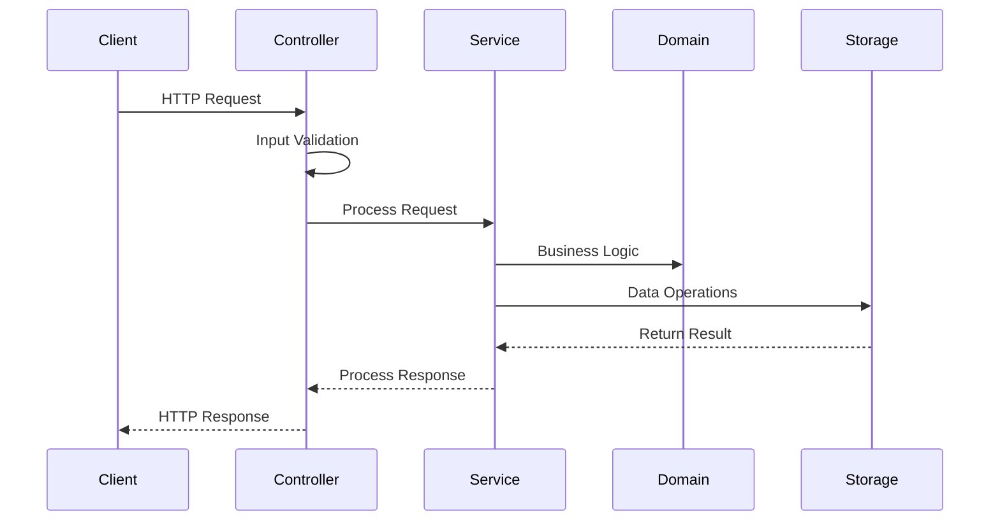
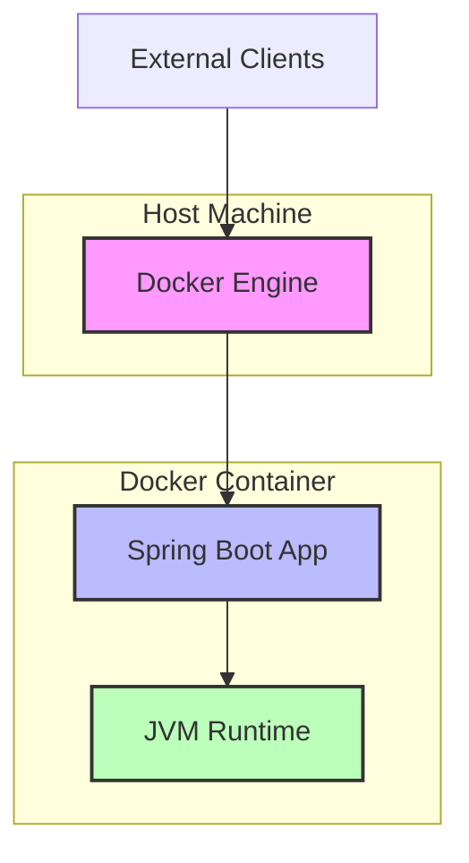

# Bank Trade Management System

A robust and scalable financial transaction management system built with Spring Boot, designed to handle banking transactions with high performance and reliability.

## System Architecture

### Architecture Diagrams

#### System Overview


#### Component Interaction


#### Deployment Architecture


### Core Components

1. **Domain Layer**
   - Transaction entity with immutable properties
   - Thread-safe in-memory storage implementation
   - Transaction type enumeration (INCOME/EXPENSE)

2. **Service Layer**
   - Transaction management service
   - Business logic implementation
   - Data validation and duplicate checking

3. **Controller Layer**
   - RESTful API endpoints
   - Request/Response handling
   - Global exception handling

4. **Exception Handling**
   - Custom exception hierarchy
   - Global exception handler
   - Standardized error responses

### Technical Stack

- **Java 21**: Latest LTS version with enhanced performance and features
- **Spring Boot 3.5.0**: Core framework providing dependency injection and auto-configuration
- **Spring Data Commons**: Data access abstraction layer
- **Spring Web**: RESTful web services support
- **Spring Test**: Comprehensive testing framework

### External Dependencies

1. **Spring Boot Starter Web**
   - Purpose: Provides web application development support
   - Version: 3.5.0
   - Key Features:
     - Embedded Tomcat server
     - Spring MVC framework
     - RESTful web services support

2. **Spring Data Commons**
   - Purpose: Data access abstraction layer
   - Version: 3.5.0
   - Key Features:
     - Repository abstraction
     - Pagination support
     - Sorting capabilities

3. **Spring Boot Starter Test**
   - Purpose: Testing framework integration
   - Version: 3.5.0
   - Key Features:
     - JUnit 5 support
     - Mockito integration
     - Spring Test utilities

## Features

### 1. Transaction Management

- **Create Transaction**
  - Input validation
  - Duplicate transaction detection
  - Automatic timestamp management
  - Thread-safe operation

- **Update Transaction**
  - Optimistic locking
  - Validation of updated data
  - Duplicate prevention
  - Audit trail maintenance

- **Delete Transaction**
  - Soft delete support
  - Cascade deletion handling
  - Transaction rollback

- **Query Transactions**
  - Pagination support
  - Sorting capabilities
  - Filtering by type and category
  - Efficient data retrieval

### 2. Data Validation

- **Input Validation**
  - Required field checking
  - Data type validation
  - Business rule enforcement
  - Custom validation rules

- **Duplicate Detection**
  - Unique constraint enforcement
  - Business key validation
  - Concurrent operation handling

### 3. Error Handling

- **Exception Hierarchy**
  - ResourceNotFoundException
  - ValidationException
  - BusinessRuleException
  - SystemException

- **Error Response Format**
  ```json
  {
    "error": "Error message",
    "timestamp": "2024-03-21T10:00:00Z",
    "path": "/api/transactions",
    "status": 400
  }
  ```

### 4. Performance Features

- **In-Memory Storage**
  - ConcurrentHashMap for thread safety
  - Efficient data access
  - Memory optimization

- **Pagination**
  - Configurable page size
  - Offset-based pagination
  - Performance optimization for large datasets

## API Documentation

### Transaction Endpoints

1. **Create Transaction**
   ```http
   POST /api/transactions
   Content-Type: application/json
   
   {
     "description": "Salary",
     "amount": 5000.00,
     "type": "INCOME",
     "category": "Salary"
   }
   ```

2. **Update Transaction**
   ```http
   PUT /api/transactions/{id}
   Content-Type: application/json
   
   {
     "description": "Updated Salary",
     "amount": 5500.00,
     "type": "INCOME",
     "category": "Salary"
   }
   ```

3. **Delete Transaction**
   ```http
   DELETE /api/transactions/{id}
   ```

4. **Get Transaction**
   ```http
   GET /api/transactions/{id}
   ```

5. **List Transactions**
   ```http
   GET /api/transactions?page=0&size=10
   ```

6. **Filter by Type**
   ```http
   GET /api/transactions/type/{type}?page=0&size=10
   ```

7. **Filter by Category**
   ```http
   GET /api/transactions/category/{category}?page=0&size=10
   ```

## Getting Started

### Prerequisites

- JDK 21
- Maven 3.8+
- IDE (IntelliJ IDEA recommended)

### Building the Project

```bash
# Clone the repository
git clone [repository-url]

# Navigate to project directory
cd banktrade

# Build the project
mvn clean install
```

### Running the Application

```bash
# Run with Maven
mvn spring-boot:run

# Or run the JAR file
java -jar target/banktrade-0.0.1-SNAPSHOT.jar
```

### Running Tests

```bash
# Run all tests
mvn test

# Run specific test class
mvn test -Dtest=BanktradeApplicationTests
```

## Development Guidelines

### Code Style

- Follow Java Code Conventions
- Use meaningful variable and method names
- Add comprehensive JavaDoc comments
- Maintain consistent code formatting

### Testing Strategy

- Unit tests for all business logic
- Integration tests for API endpoints
- Test coverage requirements
- Mock external dependencies

### Error Handling

- Use appropriate exception types
- Provide meaningful error messages
- Log exceptions with context
- Handle edge cases gracefully

## Security Considerations

- Input validation
- Data sanitization
- Error message security
- Resource access control

## Performance Considerations

- Efficient data structures
- Pagination for large datasets
- Memory management
- Concurrent operation handling

## Future Enhancements

1. **Persistence Layer**
   - Database integration
   - Caching mechanism
   - Data migration support

2. **Security Features**
   - Authentication
   - Authorization
   - API key management

3. **Monitoring**
   - Health checks
   - Metrics collection
   - Performance monitoring

4. **Documentation**
   - API documentation
   - Integration guides
   - Deployment guides

## 部署指南

### Docker 部署

1. 构建 Docker 镜像：
```bash
docker build -t banktrade .
```

2. 运行容器：
```bash
docker run -d -p 8080:8080 --name banktrade banktrade
```

3. 查看容器日志：
```bash
docker logs -f banktrade
```

4. 停止容器：
```bash
docker stop banktrade
```

5. 删除容器：
```bash
docker rm banktrade
```

### 环境变量配置

可以通过以下方式配置环境变量：

```bash
docker run -d -p 8080:8080 \
  -e JAVA_OPTS="-Xms512m -Xmx1024m" \
  -e SPRING_PROFILES_ACTIVE=prod \
  --name banktrade banktrade
```

## License

This project is licensed under the MIT License - see the LICENSE file for details. 